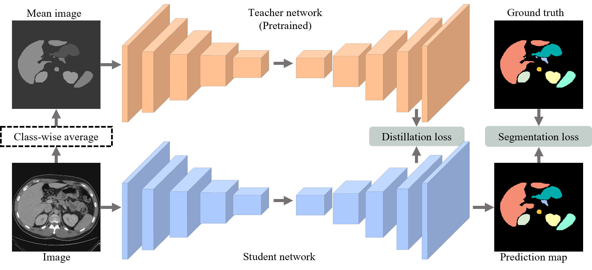

# ShapeKD
### This repository provides code for [Shape-intensity knowledge distillation for robust medical image segmentation ](https://arxiv.org/abs/2108.07774)

>**abstract:**
>—Many medical image segmentation methods based on U-Net or its alternatives have been proposed and achieved impressive
results. Yet, most existing methods perform pixel-wise classification without considering the shape prior information, 
> which is important for plausible segmentation. In this paper, we novelly leverage knowledge distillation to incorporate 
> shape information. Precisely, we train the teacher segmentation network on class-wisely averaged training images to
> extract valuable shape knowledge, which is then transferred to the student model trained on the original training
> images using segmentation and distillation loss. The student model effectively acquires the shape knowledge from 
> the teacher model, yielding more accurate segmentation. Despite its simplicity, experiments on five medical image 
> segmentation tasks of different modalities demonstrate that the proposed Shape Knowledge Distillation (ShapeKD) 
> consistently improves several baseline models under intra-dataset evaluation, and significantly improves the 
> cross-dataset generalization ability.


##### <center>Fig1. Pipeline</center>

## Usage

### Requirements
- 1.6.0 =< Pytorch <= 1.12.0
- Python >= 3.6
- Use the command "pip install -r requirements.txt" for the other dependencies.

## Getting started

### 1. Data preparation
- Download the ACDC dataset from [here](https://www.creatis.insa-lyon.fr/Challenge/acdc/) and put it in the data folder.
Then, go to the acdc_preprocess folder and run the following command to preprocess the 3D data into 2D slices.
```bash
python SliceMaker.py --in_path {data path} --out_path {output path} --data_json {data json file} --mode {train/val/test}
```
### 2. Training

- Train the teacher model by running the following command (Note that the skip-connection is removed in the teacher network that is built on the U-Net baseline, so you need to modify the 'TRAIN.NET' in the config file):

```
python -m torch.distributed.launch --nproc_per_node {num_gpus} --master_port $RANDOM tools/train.py --batch_size {batch size per gpu} --mgpus {gpu_ids} --output_dir {output path} --imgmean True
```
- Train the student model by running the following command:
```
python -m torch.distributed.launch --nproc_per_node {num_gpus} --master_port $RANDOM tools/train.py --batch_size {batch size per gpu} --mgpus {gpu_ids} --output_dir {output path} --kd True --ckpt_t {teacher model path}
```

### 4. Testing
- Go to the tools/evaluate folder and run the following command to evaluate the model:
```
python test_multi_process.py --data_path {test data path} --ckpt_path {model path} --temp_path {temp path} --gpu {gpu_id}
```

## License
This project is released under the [_**Apache 2.0**_](LICENSE) license.

## Citation
```bibtex
@inproceedings{Dong2023ShapeKD,
  title={ShapeKD: Shape Knowledge Distillation for Medical Image Segmentation},
  author={Wenhui Dong and Yongchao Xu and Bo du},
}
```
